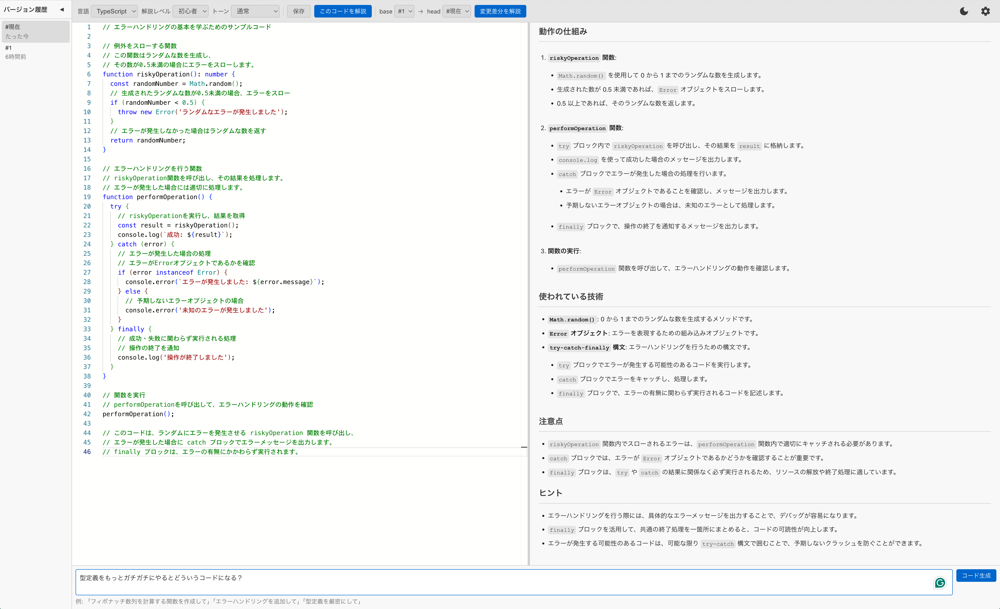

# AI Coach Web

AI を活用したコード理解・学習支援ツールのプロトタイプ Web アプリケーション。

**デモサイト**: https://aicoach-web-git-main-kotahashihamas-projects.vercel.app/



## プロジェクト概要

本プロジェクトは、将来的な VSCode 拡張機能開発に向けたコンセプト検証用プロトタイプです。AI によるコード生成が普及する中で、エンジニアが「なぜそのコードが動くのか」を理解し、構文の間違いを発見し、より良い書き方を学びながら開発できる環境の実現を目指しています。

### 検証目的

- AI による段階的なコード解説の有効性
- 習熟度に応じた説明レベルの調整
- コード生成と解説を組み合わせた学習体験
- Web ベースでの UI/UX の検証

## 現在実装されている機能

### コード解説
- **解説レベル選択**: 初心者/中級者/上級者
- **文体選択**: カジュアル/通常/フォーマル
- **ストリーミング表示**: リアルタイムで解説を生成

### コード生成・修正
- **自然言語プロンプト**: 日本語での指示に対応
- **コンテキスト考慮**: 既存コードを踏まえた生成
- **対応言語**: TypeScript, JavaScript, Python, Go, Ruby, PHP

### バージョン管理
- **スナップショット保存**: コードの変更履歴を記録
- **差分解説**: バージョン間の変更内容を AI が説明
- **履歴ビュー**: サイドバーでバージョン一覧を表示

### UI/UX
- **ダーク/ライトテーマ**: 切り替え可能
- **レイアウト調整**: パネルサイズの変更
- **設定の永続化**: ローカルストレージに保存

## クイックスタート

```bash
# クローン
git clone https://github.com/kotahashihama/aicoach-web.git
cd aicoach-web

# インストール
pnpm install

# 開発サーバー起動
pnpm dev
```

### OpenAI API キー設定

- 環境変数: `.env.example` を `.env` にコピーして `VITE_OPENAI_API_KEY` を設定
- またはアプリ内の設定モーダル（歯車アイコン）から入力

## 使い方

1. **API キー設定**: 歯車アイコンから OpenAI API キーを入力
2. **言語選択**: ドロップダウンから言語を選択
3. **コード入力**: エディタにコードを入力
4. **解説生成**: 「このコードを解説」をクリック
5. **コード生成**: 下部のプロンプト欄に指示を入力して `Ctrl+Enter`

## 技術スタック

- React 19 + TypeScript 5.9 + Vite 7
- Monaco Editor 4
- vanilla-extract
- OpenAI API (gpt-4o)

## 開発

```bash
pnpm dev            # 開発サーバー
pnpm build          # ビルド
pnpm preview        # プレビュー
pnpm tsc --noEmit   # 型チェック
pnpm lint           # ESLint
pnpm format         # Prettier
```

詳細は [CLAUDE.md](./CLAUDE.md) を参照

## 今後の構想

このプロトタイプでの検証結果を基に、以下の展開を検討しています：

- VSCode 拡張機能としての実装
- 学習履歴の記録と分析機能
- インタラクティブな練習問題
- チーム向けの知識共有機能
